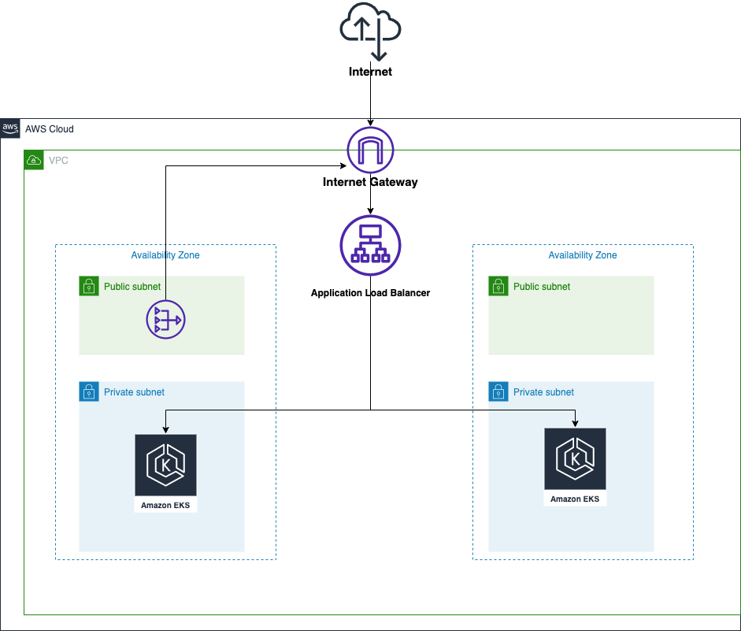

# Get Ninjas DevOps Test - Answers  [](https://app.travis-ci.com/ericcastoldi/devops_test)

## Cenário
Temos no repo https://github.com/getninjas/devops_test uma aplicação muito simples, uma API rest escrita em Golang, que atualmente só responde à rota `/healthcheck`. Essa aplicação, em compliance com o item III do 12factor app, espera alguns **parametros via ambiente** para rodar corretamente.
Outro ponto importante é que este código tem **cobertura de testes***.

## Objetivos
Dado o Cenário acima queremos que você faça o seguinte:

#### 1. Deploy da aplicação na AWS.

**Aplicação:** http://k8s-prod-getninja-e1c9510450-56777961.us-east-1.elb.amazonaws.com/healthcheck

##### Arquitetura de Infra

A rede foi configurada utilizando uma VPC com duas Availability Zones, contendo 2 subnets publicas e 2 subnets privadas. O deploy da aplicação se dá em um cluster EKS, e seu deployment roda nas subnets privadas. O Load Balancer fica recebendo as requisições vindas via Internet Gateway e repassando ao ingress do Kubernetes até que a requisição chega para os pods. Após o processamento, a resposta passa por um NAT Gateway para voltar para a internet. 

O EKS foi configurado em conjunto com o Fargate, com o objetivo de reduzir a quantidade de recursos gerenciados. Como o Fargate sobe uma micro VM para cada pod do Kubernetes, a área de ataque fica reduzida favorecendo também o ponto de vista de segurança.

No quesito escalabilidade, foi utilizado um Horizontal Pod Autoscaler que cria mais pods do deployment da aplicação de acordo com o uso de CPU. Os logs do EKS estão sendo enviados para um Log Group do CloudWatch. Tanto para o funcionamento do Autoscaler quanto para monitoramento, foi configurado o Metrics Server.

A arquitetura final ficou conforme o diagrama abaixo:



##### IaC

Toda a configuração dos recursos de Infra (recursos AWS, configurações do Kubernetes, aplicação de charts Helm, etc) foi feita utilizando o Terraform. As implementações foram separadas em 3 grandes blocos: **vpc**, **iam** e **eks**. No diretório `vpc` são definidos todos os recursos de rede, no `iam` são definidas as Roles e Policies necessárias para o funcionamento dos serviços e no `eks` é criado e configurado o cluster EKS e são configurados todos os recursos do Kubernetes como Namespaces, Deployments, Services, Ingresses, etc.

Os pré-requisitos para execução do Terraform são:

- Terraform (v1.1.4 ou superior)
- Kubectl (1.23.6 ou superior)
- AWS CLI (2.7.33 ou superior)

Foi criado um arquivo chamado `default.tfvars` com as configurações padrão para subir todos os artefatos de infra, desta forma para criar a infra devem ser executados os passos abaixo no diretório `terraform`:

```sh
terraform init
terraform apply -var-file="default.tfvars" -auto-approve
```

> *Obs:* Em alguns casos podem ocorrer erros durante o apply da infra toda de uma vez devido ao tempo de configuração de cada recurso. Caso ocorra, pode ser necessário executar o apply mais uma vez para finalizar os últimos recursos que por ventura não tenham sido criados ou não estejam disponíveis.

#### 2. Crie uma forma que possamos subir essa aplicação localmente de forma simples.

Criei um Dockerfile multistage que realiza o build da aplicação e resulta em uma imagem que executa a aplicação. Para subir a aplicação localmente basta ter o `docker` instalado e executar os comandos abaixo no diretório raiz do repositório.

```sh
docker build --tag get-ninjas-api .
docker run -p 8000:8000  get-ninjas-api

curl -i http://localhost:8000/healthcheck
HTTP/1.1 200 OK
Date: Tue, 13 Sep 2022 22:02:11 GMT
Content-Length: 24
Content-Type: text/plain; charset=utf-8

Hey Bro, Ninja is Alive!%
```

#### 3. Coloque esta aplicação em um fluxo de CI que realize teste neste código

Utilizei o Travis CI para criar uma pipeline com os jobs:

- Testes: https://app.travis-ci.com/github/ericcastoldi/devops_test/jobs/583106167
- Build App: https://app.travis-ci.com/github/ericcastoldi/devops_test/jobs/583106168
- Docker Build And Push: https://app.travis-ci.com/github/ericcastoldi/devops_test/jobs/583106169
- Terraform Plan: https://app.travis-ci.com/github/ericcastoldi/devops_test/jobs/583106170
- Terraform Apply: https://app.travis-ci.com/github/ericcastoldi/devops_test/jobs/583106171

#### 4. Altere o nome da aplicação.

O nome da aplicação é definido pela variável de ambiente `APP_NAME`, desta forma, podemos executar a imagem construída no passo anterior passando um novo valor para a variável de ambiente `APP_NAME` conforme exemplo abaixo: 

```sh
docker build --tag get-ninjas-api .
docker run -p 8000:8000 -e APP_NAME="Ninja API" get-ninjas-api

curl -i http://localhost:8000/healthcheck
HTTP/1.1 200 OK
Date: Tue, 13 Sep 2022 22:09:43 GMT
Content-Length: 24
Content-Type: text/plain; charset=utf-8

Hey Bro, Ninja API is Alive!%
```

#### 5. Discorra qual (ou quais) processos você adotaria para garantir uma entrega contínua desta aplicação, desde o desenvolvimento, até a produção.

- Versionamento do repositório (uso de tags no git + GitFlow)
- Versionamento de artefatos em geral (imagens docker, libs, módulos terraform, charts helm, etc)
- Processo de Pull Request + Code Review + Validações de CI
- Validação de percentual de cobertura de testes no CI (em tempo de Pull Request)
- Uso de análise estática de código fonte no CI (ex: SonarQube)
- Validação de vulnerabilidades em imagens docker
- Validação de vulnerabilidades nas dependências utilizadas no projeto
- Validação de dependências desatualizadas no projeto
- Automação do processo de release (versionamento/publicação de pacotes/imagens docker)
- Criação de ambientes de testes  
- Automação do processo de deploy em ambiente de testes
- Automação do rollback de uma versão aplicada
- Adoção de estratégias como blue/green ou canary para deploy em produção
